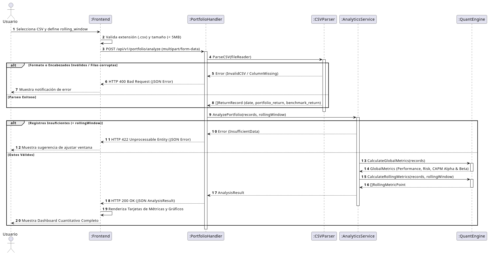

# Especificación de Requisitos y Análisis de Sistema
## Plataforma de Análisis Cuantitativo de Portafolios (Quant Engine MVP)

---

### Información del Proyecto

* **Nombre del Proyecto:** Quant Engine MVP
* **Integrantes:** Juan Martin Rodriguez
* **Fecha de Creación:** 21 de Septiembre, 2026
* **Estado:** Fase de Análisis y Especificación de Requisitos
* **Versión:** 1.1.0

---

### Abstract

**Quant Engine MVP** es una plataforma web orientada al análisis cuantitativo de portafolios financieros respecto a un índice de referencia (benchmark). La aplicación permite a analistas e inversores evaluar el rendimiento, riesgo y factores de mercado (modelo CAPM) a través de la carga de una serie temporal de retornos en formato CSV y la configuración de una ventana móvil de cálculo (rolling window).

Diseñada bajo un enfoque stateless e independiente de persistencia, la plataforma realiza el parseo de datos y el cálculo de métricas financieras clave de forma inmediata en memoria. La arquitectura desacopla estrictamente el frontend (interfaz interactiva para carga, parámetros y visualización) del backend (motor numérico expuesto vía API REST).

---

## 1. Requisitos del Sistema

### 1.1. Requisitos Funcionales (RF)

* **RF-01: Carga de archivo CSV y parametros**
  * El sistema debe permitir al usuario subir un archivo de serie temporal en formato `.csv` a través de un componente dedicado en la interfaz web.
  * El sistema debe permitir ingresar o seleccionar un parámetro opcional/configurable de ventana móvil (Rolling Window) expresado en días (ej. 30, 60, 90, 252 días).

* **RF-02: Validación de Entrada**
  * **RF-02.1 (Cliente):** El frontend debe validar la extensión `.csv` y limitar el tamaño máximo a 5 MB.
  * **RF-02.2 (Servidor):**  El backend debe validar la existencia y legibilidad de los encabezados obligatorios (`date`, `portfolio_return`, y la tercera columna equivalente al benchmark, ej. `spy` o `benchmark_return`), así como comprobar la validez numérica de los registros.

* **RF-03: Procesamiento y Cálculo de Indicadores**
 * El sistema debe calcular en memoria las siguientes métricas globales y la serie en ventana móvil (*rolling window*):

  **A. Performance Metrics (Métricas de Rendimiento)**
  1. **Total Return (Rendimiento Acumulado):** $\prod (1 + R_{p,t}) - 1$
  2. **Annualized Return (Rendimiento Anualizado):** Rendimiento geométrico ajustado a 252 días hábiles.

  **B. Risk Metrics (Métricas de Riesgo)**
  3. **Annualized Volatility (Volatilidad Anualizada):** Desviación estándar de los retornos ajustada a 252 días ($\sigma_{p} \times \sqrt{252}$).
  4. **Sharpe Ratio:** Relación de retorno excedentario respecto a la volatilidad total ($(R_p - R_f) / \sigma_p$).
  5. **Sortino Ratio:** Relación de retorno excedentario respecto al riesgo a la baja (desviación de retornos negativos).
  6. **Max Drawdown (MDD):** La mayor caída porcentual acumulada desde un pico a un valle.

  **C. CAPM & Relative Metrics (Métricas Sensibles al Mercado)**
  7. **CAPM Beta ($\beta$):** Sensibilidad o riesgo sistemático del portafolio frente al mercado ($\text{Cov}(R_p, R_m) / \text{Var}(R_m)$).
  8. **CAPM Alpha ($\alpha$ de Jensen):** Retorno excedente no explicado por el riesgo sistemático ($\alpha = R_p - [R_f + \beta(R_m - R_f)]$).

* **RF-04: Presentación de Resultados**
  * El sistema debe mostrar un resumen operativo (registros válidos procesados, rango de fechas analizado y tamaño de la ventana móvil elegida).
  * El sistema debe presentar las métricas puntuales globales en tarjetas organizadas por categorías (Performance, Risk, CAPM).
  * El sistema debe devolver y/o graficar las series en ventana móvil (*rolling metrics*) para visualizar la evolución del Beta, Sharpe y Volatilidad a lo largo del tiempo.

* **RF-05: Manejo y Gestión de Errores**
  * El sistema debe informar al usuario mediante mensajes descriptivos si el archivo contiene datos inconsistentes, fechas desordenadas, filas incompletas o valores alfanuméricos en las columnas de retornos.

---

### 1.2. Requisitos No Funcionales (RNF)

* **RNF-01: Rendimiento / Tiempo de Respuesta**
  * El tiempo total de procesamiento y respuesta de la API REST para archivos de hasta 5.000 registros (~20 años de datos diarios) no debe superar los **500 ms**.

* **RNF-02: Sin Estado (Stateless)**
  * El backend no almacenará los archivos CSV ni persistirá las métricas calculadas en bases de datos o almacenamiento en disco. Todo procesamiento debe ocurrir estrictamente en RAM.

* **RNF-03: Desacoplamiento y Modularidad**
  * El Frontend y el Backend deben permanecer totalmente desacoplados, comunicándose mediante una API REST estándar con soporte para CORS (Cross-Origin Resource Sharing).

* **RNF-04: Experiencia de Usuario (UX)**
  * La interfaz web debe proveer feedback inmediato durante el proceso de carga y análisis (estados de carga/spinner, notificaciones tipo Toast para errores).

---

# 2. Casos de Uso

### CU-01: Analizar Portafolio y Benchmark con Rolling Window

* **Actor Principal:** Usuario / Analista Web.
* **Precondiciones:** El usuario dispone de un archivo `.csv` con las columnas `date`, `portfolio_return` y `spy` (o `benchmark_return`).
* **Postcondición:** Se presentan en el dashboard las métricas globales de rendimiento, riesgo, CAPM ($\alpha$ y $\beta$), y la evolución temporal en ventana móvil.

#### Flujo Principal
1. El usuario accede a la plataforma web.
2. El usuario selecciona o arrastra el archivo CSV en el área de carga (*Dropzone*).
3. El usuario especifica la ventana móvil deseada (*Rolling Window* en días, ej. 60 días; valor por defecto: 30).
4. El frontend valida la extensión `.csv`, tamaño y que el parámetro de ventana sea un entero positivo.
5. El frontend realiza una petición HTTP `POST` a `/api/v1/portfolio/analyze` enviando el archivo en `multipart/form-data` junto con el parámetro `rolling_window`.
6. El backend parsea el CSV, alineando las series temporales del portafolio y del benchmark en memoria.
7. El backend calcula los indicadores globales (Performance, Risk, CAPM) y genera la serie temporal móvil de métricas.
8. El backend responde con un código HTTP `200 OK` y el JSON correspondiente.
9. El frontend procesa la respuesta y renderiza las tarjetas de métricas y los gráficos interactivos de la ventana móvil.

#### Flujos Alternativos

* **3a. Ventana móvil mayor al tamaño de la muestra:**
  1. El usuario ingresa un valor de *rolling window* mayor a la cantidad total de registros presentes en el CSV.
  2. El backend detecta la insuficiencia de datos para la ventana seleccionada y retorna `422 Unprocessable Entity`:
     ```json
     {
       "status": 422,
       "error": "INVALID_WINDOW_SIZE",
       "message": "La ventana móvil (120 días) no puede ser mayor al número total de observaciones en el CSV (90 registros)."
     }
     ```
  3. El frontend despliega la advertencia y solicita ajustar el tamaño de la ventana.
  4. Fin del caso de uso.

* **6a. Estructura de CSV o columnas incorrectas:**
  1. El backend no encuentra la columna del benchmark o detecta celdas vacías/no numéricas.
  2. El backend responde con un código HTTP `400 Bad Request`:
     ```json
     {
       "status": 400,
       "error": "BAD_REQUEST",
       "message": "Formato de CSV inválido: Falta la columna de retorno del benchmark ('spy' o 'benchmark_return')."
     }
     ```
  3. El frontend notifica el error en pantalla.
  4. Fin del caso de uso.

---

## 3. Diseño del Sistema 

### 3.1. Arquitectura General y Decisiones Tecnológicas

La arquitectura sigue el patrón de separación **Frontend-Backend (Decoupled)** con despliegue unificado mediante contenedores:

* **Backend:** **Go (Golang 1.22+)**

  * Elegido por su velocidad de ejecución, compilación a binarios nativos ligeros, bajo uso de memoria RAM (\~15 MB) y facilidad para manipular estructuras de datos lineales en memoria de forma altamente eficiente.

  * Utiliza un marco estándar o microframework ultraligero (`net/http` o `Chi` / `Fiber`) junto a paquetes nativos para parseo de CSV.

* **Frontend:** **React + Vite + Tailwind CSS + Recharts**

  * Proporciona un entorno interactivo y moderno con componentes para subida de archivos y gráficos dinámicos de las series en ventana móvil.

* **Orquestación y Despliegue:** **Docker & Docker Compose**

  * `docker-compose.yml` define dos servicios:

    * `backend`: Imagen multi-stage de Go (compilada en Scratch/Alpine).

    * `frontend`: Build optimizado servido opcionalmente vía Nginx o Vite Preview.

### 3.2. Estructura de Paquetes del Backend (Go)

```
backend/
├── cmd/
│   └── api/
│       └── main.go           # Entrypoint de la aplicación Go
├── internal/
│   ├── handler/
│   │   └── portfolio.go      # Handlers HTTP (parseo multipart request, serialización JSON)
│   ├── service/
│   │   └── analytics.go      # Orquestador del flujo de cálculo
│   ├── engine/
│   │   ├── capm.go           # Cálculo de Alpha y Beta
│   │   ├── metrics.go        # Total Return, Volatilidad, Sharpe, Sortino, Drawdown
│   │   └── rolling.go        # Algoritmo de ventana móvil (Rolling Window)
│   └── model/
│       └── portfolio.go      # Estructuras de datos (DTOs y Domain Entities)
├── Dockerfile
└── go.mod

```

### 3.3. Especificación OpenAPI / Contrato JSON

#### Endpoint Principal

* **URL:** `POST /api/v1/portfolio/analyze`

* **Content-Type:** `multipart/form-data`

* **Parámetros Form:**

  * `file`: Archivo `.csv` (Requerido)

  * `rolling_window`: Entero positivo (Opcional, por defecto `30`)

#### Ejemplo de Estructura JSON de Respuesta (`200 OK`)

```
{
  "summary": {
    "total_records": 252,
    "start_date": "2024-01-02",
    "end_date": "2024-12-31",
    "rolling_window_days": 30
  },
  "global_metrics": {
    "performance": {
      "total_return": 0.1845,
      "annualized_return": 0.1845
    },
    "risk": {
      "annualized_volatility": 0.1420,
      "sharpe_ratio": 1.158,
      "sortino_ratio": 1.621,
      "max_drawdown": -0.0832
    },
    "capm": {
      "alpha": 0.0241,
      "beta": 1.085
    }
  },
  "rolling_metrics": [
    {
      "date": "2024-02-14",
      "volatility": 0.1250,
      "sharpe_ratio": 1.050,
      "beta": 1.020
    }
  ]
}

```

### 3.4. Diagrama de Secuencia (PlantUML)

A continuación se detalla el flujo de interacciones desde que el usuario sube el archivo hasta que recibe la respuesta analizada:



```
@startuml
autonumber
actor "Usuario / Analista" as User
participant "Frontend (React)" as Frontend
participant "PortfolioHandler (Go)" as Handler
participant "CSVParser" as Parser
participant "AnalyticsService" as Service
participant "QuantEngine" as Engine

User -> Frontend: Selecciona CSV y define rolling_window
Frontend -> Frontend: Valida extensión (.csv) y tamaño (< 5MB)
Frontend -> Handler: POST /api/v1/portfolio/analyze (multipart/form-data)

activate Handler
Handler -> Parser: ParseCSV(fileReader)
activate Parser
alt Formato o Encabezados Inválidos / Filas corruptas
    Parser --> Handler: Error (InvalidCSV / ColumnMissing)
    Handler --> Frontend: HTTP 400 Bad Request (JSON Error)
    Frontend --> User: Muestra notificación de error
else Parseo Exitoso
    Parser --> Handler: []ReturnRecord (date, portfolio_return, benchmark_return)
end
deactivate Parser

Handler -> Service: AnalyzePortfolio(records, rollingWindow)
activate Service

alt Registros Insuficientes (< rollingWindow)
    Service --> Handler: Error (InsufficientData)
    Handler --> Frontend: HTTP 422 Unprocessable Entity (JSON Error)
    Frontend --> User: Muestra sugerencia de ajustar ventana
else Datos Válidos
    Service -> Engine: CalculateGlobalMetrics(records)
    activate Engine
    Engine --> Service: GlobalMetrics (Performance, Risk, CAPM Alpha & Beta)
    deactivate Engine

    Service -> Engine: CalculateRollingMetrics(records, rollingWindow)
    activate Engine
    Engine --> Service: []RollingMetricPoint
    deactivate Engine

    Service --> Handler: AnalysisResult
    Handler --> Frontend: HTTP 200 OK (JSON AnalysisResult)
    deactivate Service
    
    Frontend -> Frontend: Renderiza Tarjetas de Métricas y Gráficos
    Frontend --> User: Muestra Dashboard Cuantitativo Completo
end
deactivate Handler
@enduml

```